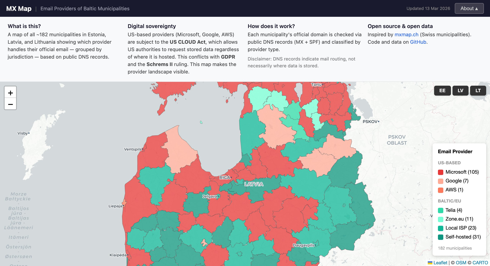

# MX Map — Nordic Email Sovereignty Map

[](https://github.com/KimTholstorf/mxmap-dk/actions/workflows/weekly.yml)

An interactive map showing where Nordic municipalities and publicly traded companies host their official email — classified by legal jurisdiction: **US Cloud**, **EU Provider**, **Self-hosted**, or **Unknown**.

Covers ~1,100 municipalities across Denmark, Finland, Norway, Sweden and Iceland, plus ~115 companies from the OMXC20, OMXS30, OBX, OMXH25 and OMXI15 stock indices.

**[mxmap.app](https://mxmap.app)**

[](https://mxmap.app)

## Why this matters

US Cloud providers (Microsoft 365, Google Workspace, AWS) are subject to the **US CLOUD Act**, which allows US authorities to demand access to stored data regardless of where it is physically hosted — even when GDPR applies. This map makes that exposure visible for Nordic public institutions and major listed companies.

## How it works

The data pipeline has three stages, run weekly via GitHub Actions:

1. **Preprocess** — Loads municipalities from seed data for DK, FI, NO, SE, IS. For each domain performs MX, SPF, CNAME, DKIM, autodiscover, TXT, and ASN lookups across three resolvers, detects email security gateways (FortiMail, Barracuda, Hornetsecurity, etc.), and classifies the backend email provider.
2. **Postprocess** — Applies manual overrides, retries DNS for unresolved entries, checks SMTP banners on independent MX hosts, and scrapes municipal websites for email addresses as a last resort.
3. **Validate** — Assigns a confidence score (0–100) to each entry based on DNS evidence quality, and enforces a quality gate before publishing.

Stock index companies are classified in a separate pass using the same DNS pipeline.

```mermaid
flowchart TD
    trigger["Weekly trigger (Monday 04:00 UTC)"] --> seed

    subgraph pre ["1 · Preprocess"]
        seed[/"Seed data\nDK · FI · NO · SE · IS · FO"/] --> fetch["Load ~1,130 municipalities"]
        fetch --> domains["Extract / guess domains"]
        domains --> dns["MX + TXT lookups\n(3 resolvers)"]
        dns --> spf_resolve["Resolve SPF includes"]
        spf_resolve --> cname["Follow CNAME chains"]
        cname --> asn["ASN lookups (Team Cymru)"]
        asn --> autodiscover["Autodiscover + DKIM lookups"]
        autodiscover --> gateway["Detect gateways\n(FortiMail, Barracuda …)"]
        gateway --> classify["Classify\nMX → CNAME → SPF → DKIM → TXT"]
    end

    classify --> overrides

    subgraph post ["2 · Postprocess"]
        overrides["Apply manual overrides"] --> retry["Retry DNS for unknowns"]
        retry --> smtp["SMTP banner check"]
        smtp --> scrape["Scrape municipal websites"]
        scrape --> reclassify["Reclassify resolved entries"]
    end

    reclassify --> companies

    subgraph idx ["Stock indices"]
        companies["Classify OMXC20 · OMXS30\nOBX · OMXH25 · OMXI15"]
    end

    companies --> data[("data.json")]
    data --> score

    subgraph val ["3 · Validate"]
        score["Confidence scoring · 0–100"] --> gate{"Quality gate\navg ≥ 70 · high-conf ≥ 80%"}
    end

    gate -- "Pass" --> build["Build frontend data files"]
    build --> deploy["Commit & deploy to mxmap.app"]
    gate -- "Fail" --> issue["Open GitHub issue"]

    style trigger fill:#e8f4fd,stroke:#4a90d9,color:#1a5276
    style seed fill:#e8f4fd,stroke:#4a90d9,color:#1a5276
    style data fill:#d5f5e3,stroke:#27ae60,color:#1e8449
    style deploy fill:#d5f5e3,stroke:#27ae60,color:#1e8449
    style issue fill:#fadbd8,stroke:#e74c3c,color:#922b21
    style gate fill:#fdebd0,stroke:#e67e22,color:#935116
```



## Coverage

### Municipalities

| Country | Municipalities |
|---------|:--------------:|
| 🇩🇰 Denmark | ~98 |
| 🇫🇮 Finland | ~309 |
| 🇳🇴 Norway | ~356 |
| 🇸🇪 Sweden | ~290 |
| 🇮🇸 Iceland | ~64 |
| 🇫🇴 Faroe Islands | 29 |
| **Total** | **~1,130** |

### Stock indices

| Index | Country | Companies |
|-------|---------|:---------:|
| OMXC20 | 🇩🇰 Denmark | 20 |
| OMXS30 | 🇸🇪 Sweden | 30 |
| OBX | 🇳🇴 Norway | 25 |
| OMXH25 | 🇫🇮 Finland | 25 |
| OMXI15 | 🇮🇸 Iceland | 15 |
| **Total** | | **~115** |

## Quick start

```bash
uv sync

# Run the full pipeline for all Nordic countries
uv run preprocess DK FI NO SE IS FO
uv run postprocess
uv run validate

# Classify stock index companies
uv run python3 scripts/classify_nordic_indices.py   # OBX, OMXS30, OMXH25, OMXI15
uv run python3 scripts/classify_omxc20.py           # OMXC20

# Build frontend data files
uv run python3 scripts/build_frontend.py

# Serve the map locally
python -m http.server
```

## Development

```bash
uv sync --group dev

uv run pytest --cov --cov-report=term-missing   # Tests (90% coverage threshold)
uv run ruff check src tests                      # Lint
uv run ruff format src tests                     # Format
```

## Weekly pipeline

A [GitHub Actions workflow](.github/workflows/weekly.yml) runs every Monday at 04:00 UTC:

- Scans all ~1,100 Nordic municipalities via DNS
- Rescans all ~115 stock index companies
- Validates results against a quality gate (average confidence ≥ 70, ≥ 80% of entries above 80)
- Commits updated data and deploys to [mxmap.app](https://mxmap.app) via GitHub Pages
- Opens a GitHub issue if the quality gate fails

The workflow can also be triggered manually from the [Actions tab](https://github.com/KimTholstorf/mxmap-dk/actions/workflows/weekly.yml).

## Attribution

Built on [livenson/mxmap](https://github.com/livenson/mxmap), which extended the original [mxmap.ch](https://mxmap.ch) by [David Huser](https://github.com/davidhuser/mxmap) from Swiss municipalities to a worldwide dataset. This project narrows the focus to the Nordic region and adds stock index company classification, a sovereignty-framed legend, and a redesigned frontend.

## Related

- [mxmap.ch](https://mxmap.ch) — the original Swiss municipality email provider map by David Huser
- [livenson/mxmap](https://github.com/livenson/mxmap) — worldwide fork this project is based on
- [swedish-mail-dependency.netlify.app](https://swedish-mail-dependency.netlify.app) — Swedish-focused equivalent
- [kommune-epost-norge.netlify.app](https://kommune-epost-norge.netlify.app) — Norwegian-focused equivalent
