# MX Map — Email Providers of European Municipalities

[](https://github.com/livenson/mxmap/actions/workflows/nightly.yml)

An interactive map showing where ~8,300 municipalities across 31 European countries host their official email — whether with US hyperscalers (Microsoft, Google, AWS), local/EU providers, or self-hosted solutions.

All 27 EU member states plus Norway, Iceland, Andorra, and the United Kingdom.

**[View the live map](https://livenson.github.io/mxmap/)**

[](https://livenson.github.io/mxmap/)

## How it works

The data pipeline has three steps:

1. **Preprocess** — Loads ~8,300 municipalities from curated seed data across 31 countries, performs MX, SPF, CNAME, DKIM, autodiscover, and TXT DNS lookups on their official domains (with domain guessing for missing entries), detects email security gateways (SeppMail, Barracuda, Hornetsecurity, etc.), and classifies each municipality's email provider. TXT domain verification tokens (e.g., `MS=` for Microsoft 365, `google-site-verification=` for Google Workspace) serve as tiebreakers when other signals are ambiguous.
2. **Postprocess** — Applies manual overrides for edge cases, retries DNS for unresolved domains, checks SMTP banners of independent MX hosts for hidden providers, then scrapes websites of still-unclassified municipalities for email addresses.
3. **Validate** — Cross-validates MX and SPF records, assigns a confidence score (0–100) to each entry, and generates a validation report.

```mermaid
flowchart TD
    trigger["Nightly trigger"] --> seed

    subgraph pre ["1 · Preprocess"]
        seed[/"Seed data (31 countries)"/] --> fetch["Load ~8,300 municipalities"]
        fetch --> domains["Extract domains +<br/>guess candidates"]
        domains --> dns["MX + TXT lookups<br/>(3 resolvers)"]
        dns --> spf_resolve["Resolve SPF includes<br/>& redirects"]
        spf_resolve --> cname["Follow CNAME chains"]
        cname --> asn["ASN lookups<br/>(Team Cymru)"]
        asn --> autodiscover["Autodiscover DNS<br/>(CNAME + SRV)"]
        autodiscover --> dkim["DKIM selector<br/>CNAME lookups"]
        dkim --> gateway["Detect gateways<br/>(SeppMail, Barracuda,<br/>Proofpoint, Sophos ...)"]
        gateway --> classify["Classify providers<br/>MX → CNAME → SPF →<br/>Autodiscover → DKIM → TXT"]
    end

    classify --> overrides

    subgraph post ["2 · Postprocess"]
        overrides["Apply manual overrides"] --> retry["Retry DNS<br/>for unknowns"]
        retry --> smtp["SMTP banner check<br/>(EHLO on port 25)"]
        smtp --> scrape_urls["Probe municipal websites<br/>(/kontaktid, /kontakti, /kontaktai …)"]
        scrape_urls --> extract["Extract emails<br/>+ decrypt TYPO3 obfuscation"]
        extract --> scrape_dns["DNS lookup on<br/>email domains"]
        scrape_dns --> reclassify["Reclassify<br/>resolved entries"]
    end

    reclassify --> data[("data.json")]
    data --> score

    subgraph val ["3 · Validate"]
        score["Confidence scoring · 0–100"] --> gwarn["Flag potential<br/>unknown gateways"]
        gwarn --> gate{"Quality gate<br/>avg ≥ 70 · high-conf ≥ 80%"}
    end

    gate -- "Pass" --> deploy["Commit & deploy to Pages"]
    gate -- "Fail" --> issue["Open GitHub issue"]

    style trigger fill:#e8f4fd,stroke:#4a90d9,color:#1a5276
    style seed fill:#e8f4fd,stroke:#4a90d9,color:#1a5276
    style data fill:#d5f5e3,stroke:#27ae60,color:#1e8449
    style deploy fill:#d5f5e3,stroke:#27ae60,color:#1e8449
    style issue fill:#fadbd8,stroke:#e74c3c,color:#922b21
    style gate fill:#fdebd0,stroke:#e67e22,color:#935116
```



## Quick start

```bash
uv sync

uv run preprocess
uv run postprocess
uv run validate

# Serve the map locally
python -m http.server
```

## Development

```bash
uv sync --group dev

# Run tests with coverage
uv run pytest --cov --cov-report=term-missing

# Lint the codebase
uv run ruff check src tests
uv run ruff format src tests
```

## Attribution

This project is a fork of [mxmap.ch](https://mxmap.ch) by [David Huser](https://github.com/davidhuser/mxmap), which maps email providers of Swiss municipalities. Adapted for 31 European countries (all 27 EU member states + 4 non-EU) with region-specific provider detection (Telia, TET, Zone.eu, local ISPs), gateway look-through (SeppMail, Barracuda, Hornetsecurity, etc.), DKIM/TXT verification-based classification, curated seed data, and per-country TopoJSON geodata.

## Related work

* [mxmap.ch](https://mxmap.ch) — the original Swiss municipality email provider map
* [hpr4379 :: Mapping Municipalities' Digital Dependencies](https://hackerpublicradio.org/eps/hpr4379/index.html)
* If you know of similar projects for other countries, please open an issue or submit a PR!

## Contributing

If you spot a misclassification, please open an issue with the municipality ID and the correct provider.
For municipalities where automated detection fails, corrections can be added to the `MANUAL_OVERRIDES` dict in `src/mail_sovereignty/postprocess.py`.
