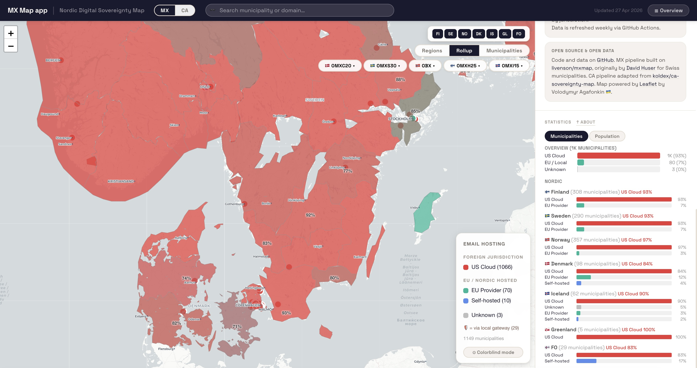
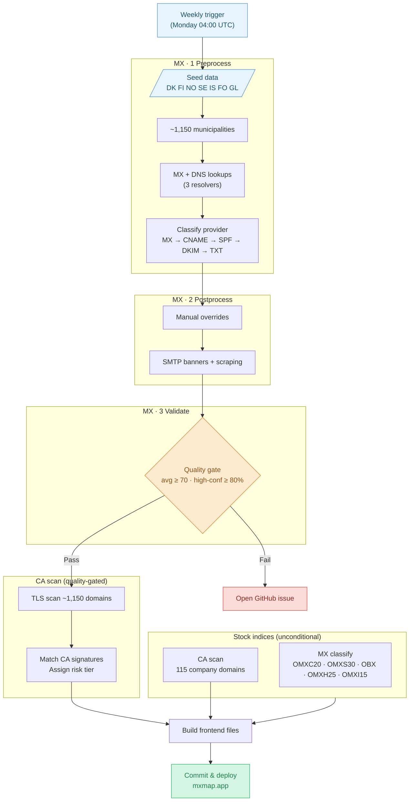

# MX Map — Nordic Digital Sovereignty Map

[](https://github.com/KimTholstorf/mxmap-dk/actions/workflows/weekly.yml)

An interactive map showing digital sovereignty exposure for Nordic municipalities and publicly traded companies across two dimensions:

- **MX view** — which provider handles official email, classified by legal jurisdiction
- **CA view** — which Certificate Authority controls the TLS certificate for each public website

Covers ~1,150 municipalities across Denmark, Finland, Norway, Sweden, Iceland, the Faroe Islands and Greenland, plus ~115 companies from the OMXC20, OMXS30, OBX, OMXH25 and OMXI15 stock indices.

**[mxmap.app](https://mxmap.app)**

[](https://mxmap.app)

## Why this matters

US-headquartered providers — Microsoft, Google, Amazon, DigiCert, Let's Encrypt (ISRG) and others — are subject to the **US CLOUD Act**, which allows US authorities to demand access to data and infrastructure regardless of where it is physically hosted, even when GDPR applies.

An institution may have migrated email to a European provider yet still rely on a US-controlled CA for its public website — or vice versa. Both layers matter for a complete sovereignty assessment. This map makes both visible.

## Two views

### MX — Email sovereignty

Each domain's MX records are resolved and the backend email provider identified, looking through email security gateways (FortiMail, Barracuda, Heimdal, Mimecast, etc.) to the actual hosting provider. Classified into four jurisdictions:

| Category | Examples |
|----------|---------|
| US Cloud | Microsoft 365, Google Workspace, AWS |
| EU Provider | Zone, Telia, local ISPs |
| Self-hosted | Own MX infrastructure |
| Unknown | No MX records found |

### CA — Certificate Authority sovereignty

Each domain is scanned via a live TLS handshake. The issuing CA is matched against a signature database and classified into five risk tiers:

| Tier | Jurisdiction | Examples |
|------|-------------|---------|
| Critical | US CLOUD Act | DigiCert, Amazon, Google Trust |
| High | US non-profit | Let's Encrypt (ISRG) |
| Medium | Allied non-EU | GlobalSign |
| Low | EU-controlled | HARICA, Certum, D-TRUST |
| Minimal | Nordic / national | Buypass, Telia |

## How it works

### MX pipeline (3 stages, weekly)

1. **Preprocess** — Loads municipalities from seed data (DK, FI, NO, SE, IS, FO, GL). For each domain: MX, SPF, CNAME, DKIM, autodiscover, TXT and ASN lookups across three resolvers. Detects email security gateways and classifies the backend provider with confidence scoring.
2. **Postprocess** — Applies manual overrides, retries DNS for unresolved entries, checks SMTP banners on independent MX hosts, scrapes municipal websites as a last resort.
3. **Validate** — Assigns a confidence score (0–100) per entry and enforces a quality gate before publishing.

### CA pipeline (weekly, independent)

Async TLS scan of all municipality and company domains. Certificate chain retrieved, leaf issuer matched against CA signature database, classified into risk tier with confidence scoring. Municipalities gated on MX quality; company CA scan runs unconditionally.

### Stock indices (weekly, independent)

DNS classification of all ~115 companies using the same MX pipeline, plus a separate CA scan, both running unconditionally regardless of municipality quality gate.


```mermaid
flowchart TD
    trigger["Weekly trigger\n(Monday 04:00 UTC)"] --> seed

    subgraph pre ["MX · 1 Preprocess"]
        seed[/"Seed data\nDK FI NO SE IS FO GL"/] --> fetch["~1,150 municipalities"]
        fetch --> dns["MX + DNS lookups\n(3 resolvers)"]
        dns --> classify["Classify provider\nMX → CNAME → SPF → DKIM → TXT"]
    end

    subgraph post ["MX · 2 Postprocess"]
        classify --> overrides["Manual overrides"]
        overrides --> smtp["SMTP banners + scraping"]
    end

    subgraph val ["MX · 3 Validate"]
        smtp --> gate{"Quality gate\navg ≥ 70 · high-conf ≥ 80%"}
    end

    subgraph idx ["Stock indices (unconditional)"]
        companies["MX classify\nOMXC20 · OMXS30 · OBX · OMXH25 · OMXI15"]
        companies_ca["CA scan\n115 company domains"]
    end

    gate -- "Pass" --> ca_scan
    gate -- "Fail" --> issue["Open GitHub issue"]

    subgraph ca ["CA scan (quality-gated)"]
        ca_scan["TLS scan ~1,150 domains"]
        ca_scan --> ca_classify["Match CA signatures\nAssign risk tier"]
    end

    ca_classify --> build["Build frontend files"]
    companies_ca --> build
    idx --> build
    build --> commit["Commit & deploy\nmxmap.app"]

    style trigger fill:#e8f4fd,stroke:#4a90d9,color:#1a5276
    style seed fill:#e8f4fd,stroke:#4a90d9,color:#1a5276
    style commit fill:#d5f5e3,stroke:#27ae60,color:#1e8449
    style issue fill:#fadbd8,stroke:#e74c3c,color:#922b21
    style gate fill:#fdebd0,stroke:#e67e22,color:#935116
```

## Coverage

### Municipalities

| Country | Municipalities |
|---------|:--------------:|
| 🇩🇰 Denmark | ~98 |
| 🇫🇮 Finland | ~309 |
| 🇳🇴 Norway | ~356 |
| 🇸🇪 Sweden | ~290 |
| 🇮🇸 Iceland | ~64 |
| 🇫🇴 Faroe Islands | 29 |
| 🇬🇱 Greenland | 5 |
| **Total** | **~1,150** |

### Stock indices

| Index | Country | Companies |
|-------|---------|:---------:|
| OMXC20 | 🇩🇰 Denmark | 20 |
| OMXS30 | 🇸🇪 Sweden | 30 |
| OBX | 🇳🇴 Norway | 25 |
| OMXH25 | 🇫🇮 Finland | 25 |
| OMXI15 | 🇮🇸 Iceland | 15 |
| **Total** | | **115** |

## Quick start

```bash
uv sync

# MX pipeline
uv run preprocess DK FI NO SE IS FO GL
uv run postprocess
uv run validate

# CA scan (municipalities)
uv run scan-certs --skip-ct --timeout 20

# Stock index companies (MX + CA)
uv run python3 scripts/classify_nordic_indices.py   # OBX, OMXS30, OMXH25, OMXI15
uv run python3 scripts/classify_omxc20.py           # OMXC20
uv run python3 scripts/scan_companies_ca.py --skip-ct --timeout 20

# Build frontend data files
uv run python3 scripts/build_frontend.py
uv run python3 scripts/build_ca_frontend.py
uv run python3 scripts/build_companies_ca_frontend.py

# Serve locally
python -m http.server
```

## Development

```bash
uv sync --group dev

uv run pytest --cov --cov-report=term-missing   # Tests (90% coverage threshold)
uv run ruff check src tests                      # Lint
uv run ruff format src tests                     # Format
```

## Weekly pipeline

A [GitHub Actions workflow](.github/workflows/weekly.yml) runs every Monday at 04:00 UTC:

- MX-scans all ~1,150 Nordic municipalities and quality-gates before publishing
- CA-scans all ~1,150 municipality domains (gated) and all 115 company domains (unconditional)
- MX-classifies all 115 stock index companies
- Commits updated data and deploys to [mxmap.app](https://mxmap.app) via GitHub Pages
- Opens a GitHub issue if the municipality quality gate fails

Can also be triggered manually from the [Actions tab](https://github.com/KimTholstorf/mxmap-dk/actions/workflows/weekly.yml).

## Attribution

MX pipeline built on [livenson/mxmap](https://github.com/livenson/mxmap), which extended the original [mxmap.ch](https://mxmap.ch) by [David Huser](https://github.com/davidhuser/mxmap) from Swiss municipalities to a worldwide dataset. CA pipeline adapted from [koldex/ca-sovereignty-map](https://github.com/koldex/ca-sovereignty-map).

## Related

- [mxmap.ch](https://mxmap.ch) — the original Swiss municipality email provider map by David Huser
- [livenson/mxmap](https://github.com/livenson/mxmap) — worldwide fork this project is based on
- [koldex/ca-sovereignty-map](https://github.com/koldex/ca-sovereignty-map) — CA-focused Nordic & Baltic equivalent, basis for the CA pipeline
- [swedish-mail-dependency.netlify.app](https://swedish-mail-dependency.netlify.app) — Swedish-focused equivalent
- [kommune-epost-norge.netlify.app](https://kommune-epost-norge.netlify.app) — Norwegian-focused equivalent
